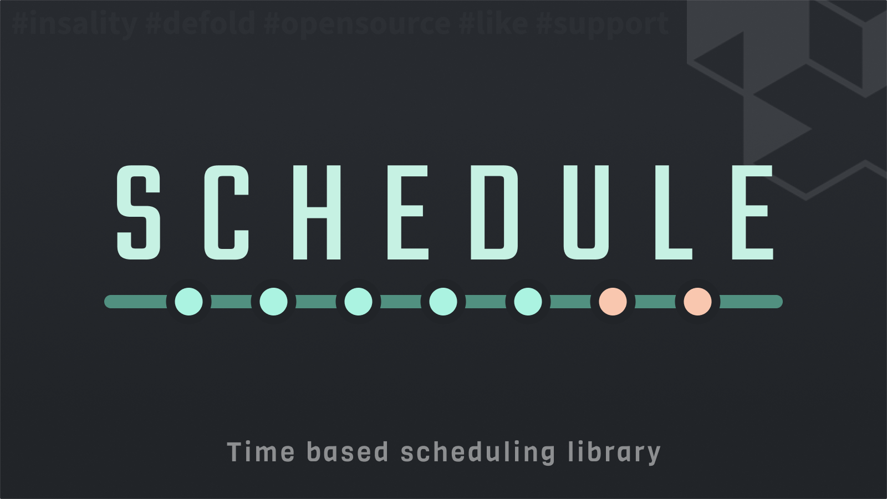

[](https://github.com/Insality/defold-schedule/tags)
[](https://github.com/Insality/defold-schedule/actions)
[](https://codecov.io/gh/Insality/defold-schedule)

[](https://github.com/sponsors/insality) [](https://ko-fi.com/insality) [](https://www.buymeacoffee.com/insality)

# Defold Schedule

**Schedule** is a time-based scheduling library for **Defold**.
It provides **timers** and **events with duration** that work offline, are fully persistent.

The library is designed to cover casual game needs such as crafting, cooldowns, LiveOps events, offers, and offline progression.


## Features

- One-shot timers (fire once in the future)
- Events with duration (`start` / `end`)
- Offline progression and deterministic catch-up
- Generated IDs for timers and events
- Query status by ID at any time
- Categories for filtering and grouping
- Custom conditions (tokens, progression, etc.)
- Payload support
- Declarative builder API
- Serializable state


## Setup

### [Dependency](https://www.defold.com/manuals/libraries/)

Open your `game.project` file and add the following line to the dependencies field under the project section:

**[Defold Schedule](https://github.com/Insality/defold-schedule/archive/refs/tags/1.zip)**

```
https://github.com/Insality/defold-schedule/archive/refs/tags/1.zip
```


### Library Size

> **Note:** The library size is calculated based on the build report per platform
> Schedule module will be included in the build only if you use it.

| Platform         | Size          |
| ---------------- | ------------- |
| HTML5            | **1.68 KB**   |
| Desktop / Mobile | **2.88 KB**   |


## API Reference

### Quick API Reference

```lua
local schedule = require("schedule.schedule")

-- Events
schedule.event()
schedule.get_status(event_id)

schedule.register_condition(condition_name, fun(data))

-- State
schedule.get_state()
schedule.set_state(new_state)
schedule.reset_state()

-- System
schedule.set_logger([logger_instance])
```

```lua
local schedule = require("schedule.schedule")

schedule.event()
	:category(category_name)
	:payload(payload)
	-- When to start, choose one of the following
	:after(time)
	:start_at(time) -- Unix seconds or ISO (YYYY-MM-DDTHH:MM:SS)
	-- Note: Weekly and yearly cycles can work without start_at - they compute next occurrence from now
	-- When to end, choose one of the following
	:duration(time)
	:end_at(time)
	:infinity() -- Works until manual cancellation
	:min_time(time) -- Do not start if not enough time left
	-- Conditions
	:condition(condition_name, data)
	:on_fail("cancel|abort")
	-- Repeat
	:cycle("every", { seconds = 60, anchor = "start|end", skip_missed = true })
	:cycle("weekly", { weekdays = {"sun"}, time = "HH:MM", skip_missed = true })
	:cycle("monthly", { day = 1..31, time = "HH:MM", skip_missed = true })
	:cycle("yearly", { month = 1..12, day = 1..31, time = "HH:MM", skip_missed = true })
	:catch_up(true|false) -- do not catch up if missed. With duration default is false, without - true
	-- Complete
	:save()
```

For detailed API documentation, please refer to:
- [API Reference](api/schedule_api.md)


## Use Cases

Read the [Use Cases](USE_CASES.md) file to see several examples of how to use the Event module in your Defold game development projects.


## License

This project is licensed under the MIT License - see the LICENSE file for details.


## Issues and suggestions

If you have any issues, questions or suggestions please [create an issue](https://github.com/Insality/defold-schedule/issues).


## 👏 Contributors

<a href="https://github.com/Insality/defold-event/graphs/contributors">
  
</a>


## ❤️ Support project ❤️

Your donation helps me stay engaged in creating valuable projects for **Defold**. If you appreciate what I'm doing, please consider supporting me!

[](https://github.com/sponsors/insality) [](https://ko-fi.com/insality) [](https://www.buymeacoffee.com/insality)
