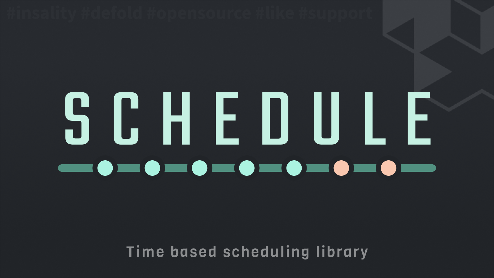

[](https://github.com/Insality/defold-schedule/tags)
[](https://github.com/Insality/defold-schedule/actions)
[](https://codecov.io/gh/Insality/defold-schedule)

[](https://github.com/sponsors/insality) [](https://ko-fi.com/insality) [](https://www.buymeacoffee.com/insality)

# Disclaimer

This library is still in development and the API is subject to change.


# Defold Schedule

**Schedule** is a time-based scheduling library for **Defold**.
It provides **timers** and **events with duration** that work offline, are fully persistent.

The library is designed to cover casual game needs such as crafting, cooldowns, LiveOps events, offers, and offline progression.


## Features

- One-shot timers (fire once in the future)
- Events with duration (`start` / `end`)
- Offline progression and deterministic catch-up
- Recurring events: interval, weekly, monthly and yearly cycles
- Event chaining (start after another event completes)
- Query status, remaining time and progress by ID at any time
- Categories for filtering and grouping
- Custom conditions (tokens, progression, etc.)
- Payload support
- Declarative builder API
- Serializable state, pluggable time source (device clock or server time)

> **Time is always UTC.** Timestamps are Unix seconds and ISO strings like `"2026-01-01T00:00:00"`
> are parsed as UTC, there is no local time zone conversion.


## Setup

### [Dependency](https://www.defold.com/manuals/libraries/)

Open your `game.project` file and add the following line to the dependencies field under the project section:


**[Defold Event](https://github.com/Insality/defold-event)**

```
https://github.com/Insality/defold-event/archive/refs/tags/20.zip
```

**[Defold Schedule](https://github.com/Insality/defold-schedule/archive/refs/tags/2.zip)**

```
https://github.com/Insality/defold-schedule/archive/refs/tags/2.zip
```


### Library Size

> **Note:** The library size is calculated based on the build report per platform
> Schedule module will be included in the build only if you use it.

| Platform         | Size          |
| ---------------- | ------------- |
| HTML5            | **14.71 KB**   |
| Desktop / Mobile | **23.87 KB**   |


## API Reference

### Quick API Reference

```lua
local schedule = require("schedule.schedule")

-- State
schedule.reset_state()
schedule.get_state()
schedule.set_state(new_state)

schedule.update()

-- Events
schedule.event([id]) -- Returns a builder, see below
schedule.get(event_id) -- Returns an event object
schedule.get_event_state(event_id) -- Returns the raw state table
schedule.filter([category], [status])
schedule.remove(event_id)
schedule.clear([category], [status])

-- Conditions
schedule.register_condition(name, [evaluator])

-- Time source, use it to run the schedule on server time
schedule.set_time_function([callback])
schedule.get_time()

schedule.set_logger([logger_instance])

-- Time constants
schedule.SECOND
schedule.MINUTE
schedule.HOUR
schedule.DAY
schedule.WEEK

-- Global event subscription queue
schedule.on_event -- queue<schedule.lifecycle.event_data>
```

An event object returned by `schedule.get()` or `:save()`:

```lua
local event = schedule.get(event_id)

event:get_id()
event:get_status() -- "pending", "active", "completed", "cancelled", "aborted", "paused"
event:is_active()
event:get_time_left()
event:get_time_to_start()
event:get_progress()
event:get_start_time()
event:get_end_time()
event:get_cycle_count()
event:get_category()
event:get_payload()

event:start()
event:pause()
event:resume()
event:finish()
event:cancel()
```

```lua
local schedule = require("schedule.schedule")

schedule.event()
	:category(category_name)
	:payload(payload)
	-- When to start, choose one of the following
	:after(time)
	:start_at(time) -- Unix seconds or ISO (YYYY-MM-DDTHH:MM:SS)
	-- Note: Weekly and yearly cycles can work without start_at - they compute next occurrence from now
	-- When to end, choose one of the following
	:duration(time)
	:end_at(time)
	:infinity() -- Works until manual cancellation
	:min_time(time) -- Do not start if not enough time left
	-- Conditions
	:condition(condition_name, data)
	:abort_on_fail() -- Abort event when conditions fail
	-- Repeat
	:cycle("every", { seconds = 60, anchor = "start|end", skip_missed = true })
	:cycle("weekly", { weekdays = {"sun"}, time = "HH:MM", skip_missed = true })
	:cycle("monthly", { day = 1..31, time = "HH:MM", skip_missed = true })
	:cycle("yearly", { month = 1..12, day = 1..31, time = "HH:MM", skip_missed = true })
	:catch_up(true|false) -- Replay occurrences missed while offline. Default: false with a duration, true without
	-- Lifecycle callbacks, all receive { event_id, category, payload, status, start_time, end_time }
	:on_start(callback) -- Event activated
	:on_enabled(callback) -- Event became active, also on state restore and on catch-up
	:on_disabled(callback) -- Event stopped being active
	:on_end(callback) -- Event completed
	:on_fail(callback) -- Conditions failed with abort_on_fail
	-- Complete
	:save() -- Returns the event object
```

Statuses: an event goes `pending` to `active` to `completed`. `cancelled` and `aborted` are terminal,
the update loop never revives them, use `event:start()` to run such an event anyway.

For detailed API documentation, please refer to:
- [API Reference](api/schedule_api.md)
- [Event Builder API](api/schedule_event_builder.md)
- [Event API](api/schedule_event.md)


## Persistence

The schedule keeps all its data in one serializable table. Save it with your save system and restore it
on load, **before** you declare your events:

```lua
local saver = require("saver.saver")
local schedule = require("schedule.schedule")

function init(self)
	saver.init()
	saver.bind_save_state("schedule", schedule.get_state())

	-- Declare your events after the state is restored.
	-- Re-declaring an event with the same id keeps its stored timings and re-attaches the callbacks
	schedule.event("craft_sword")
		:category("craft")
		:after(schedule.HOUR)
		:on_end(function(event_data) give_item("sword") end)
		:save()

	timer.delay(1, true, function()
		schedule.update()
	end)
end
```

Lifecycle callbacks are functions, so they can not be serialized. Declaring your events on every game start
is the intended flow: stored timings, status and cycle counters are kept, only the callbacks are re-attached.

Completed one-shot events stay in the state until you remove them. Drop the ones you no longer need with
`schedule.remove(event_id)` or `schedule.clear(category, "completed")` to keep the save file small.


## Use Cases

Read the [Use Cases](USE_CASES.md) file for worked examples: crafting timers and building queues,
cooldowns, energy regeneration, LiveOps windows, daily rewards, offers with conditions and event chaining.

It starts with the two ways to use the schedule - **pull** (keep the event id and query it) and
**push** (attach callbacks and let the schedule call you) - and when to pick which.


## License

This project is licensed under the MIT License - see the LICENSE file for details.


## Issues and suggestions

If you have any issues, questions or suggestions please [create an issue](https://github.com/Insality/defold-schedule/issues).


## 👏 Contributors

<a href="https://github.com/Insality/defold-schedule/graphs/contributors">
  
</a>


## ❤️ Support project ❤️

Your donation helps me stay engaged in creating valuable projects for **Defold**. If you appreciate what I'm doing, please consider supporting me!

[](https://github.com/sponsors/insality) [](https://ko-fi.com/insality) [](https://www.buymeacoffee.com/insality)
